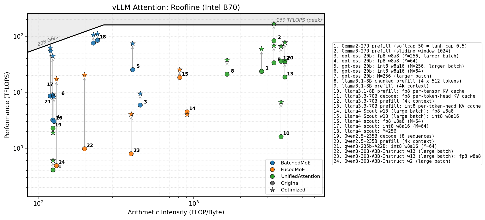

<p align="center">
  
</p>

# Xe Forge

Multi-stage LLM-driven optimization pipeline for Triton kernels targeting Intel XPU.

[](https://scorecard.dev/viewer/?uri=github.com/IntelLabs/Xe-Forge)

The optimizer analyzes Triton kernels, identifies performance issues, and applies optimizations through a series of stages — each powered by an LLM that understands GPU programming, numerical linear algebra, and Intel XPU hardware. Two engines are available: a fully automated DSPy pipeline and a Claude Code engine that generates a ready-to-run workspace you can drive interactively or let xe-forge auto-launch.

📄 **Paper**: [Xe-Forge: Multi-Stage LLM-Powered Kernel Optimization for Intel GPU](https://arxiv.org/abs/2605.26118) (arXiv:2605.26118) — describes the system architecture, the Chain-of-Verification-and-Refinement (CoVeR) agent design, and the Intel GPU knowledge base, along with extensive evaluation on KernelBench Level-2 kernels and Flash Attention on the Intel Arc Pro B70. See the paper for the full set of results and additional details beyond what's covered here.

⚠️ **Disclaimer**: This project is currently in active development. The code is **not stable** and **not intended for use in production environments**. Interfaces, features, and behaviors are subject to change without notice.

---

## Table of Contents

- [Results on Intel Arc Pro B70](#results-on-intel-arc-pro-b70)
  - [FlashAttention Forward](#flashattention-forward)
  - [vLLM Attention](#vllm-attention)
  - [GEMM / Matmul Kernels (L2 KernelBench)](#gemm--matmul-kernels-l2-kernelbench)
- [How It Works](#how-it-works)
- [Installation](#installation)
- [Quick Start](#quick-start)
- [Engines](#engines)
- [Skill CLI](#skill-cli)
- [Writing the Model Class](#writing-the-model-class)
- [Writing the YAML Spec File](#writing-the-yaml-spec-file)
- [File Layout](#file-layout)
- [Optimization Stages](#optimization-stages)
- [CLI Reference](#cli-reference)
- [Environment Variables Reference](#environment-variables-reference)
- [Knowledge Base](#knowledge-base)
- [Examples](#examples)
- [Roofline Plots](#roofline-plots)
- [Troubleshooting](#troubleshooting)
- [Citation](#citation)
- [License](#license)

---

## Results on Intel Arc Pro B70

### FlashAttention Forward

FlashAttention benchmark optimized across diverse shapes including skinny, non-square, and irregular configurations (varying head counts, sequence lengths, and head dimensions). Up to **10.6x** speedup over unoptimized Triton kernels, with optimized kernels reaching over **80 TFLOPS** on Intel Arc Pro B70.

<p align="center">
  
</p>

### vLLM Attention

Three attention variants from [vLLM](https://github.com/vllm-project/vllm) — `BatchedMoE`, `FusedMoE`, and `UnifiedAttention` — optimized across 24 real-world attention configurations drawn from production models (Gemma2/3-27B, gpt-oss 20B, Llama3.1-8B, Llama3.3-70B, Llama4 Scout, Qwen2.5/3), covering prefill, decode, chunked prefill, sliding-window, and fp8/int8 KV-cache and weight-quantized setups. Each configuration's original kernel (circle) is lifted to its Xe-Forge–optimized counterpart (star), for a **geometric-mean 2.8x speedup** across the suite. Relative gains are largest on memory-bound configs lifted off near-zero baselines (up to **35x** for Qwen3-30B-A3B-Instruct), while the highest absolute throughput comes from the compute-bound Gemma3-27B prefill kernel, which reaches the **160 TFLOPS** peak on Intel Arc Pro B70. Marker numbers map to the configurations listed in the legend.

<p align="center">
  
</p>

### GEMM / Matmul Kernels (L2 KernelBench)

[KernelBench](https://github.com/ScalingIntelligence/KernelBench) L2 GEMM and Matmul problems. Optimized Triton kernels surpass both PyTorch eager and `torch.compile` baselines, exceeding the **160 TFLOPS** peak roofline ceiling for compute-bound configurations.

<p align="center">
  
</p>

---

## How It Works

1. **Analysis**: The analyzer agent examines the kernel and produces a structured list of issues, each tagged with a category (e.g. `dtype_float64`, `suboptimal_tile_size`, `missing_autotune`).

2. **Planning**: Each issue is mapped to an optimization stage. Stages with no issues are skipped.

3. **Optimization**: For each active stage, the optimizer agent receives the kernel code, issue descriptions, hardware configuration, and problem context (input shapes, dtype, FLOPs, arithmetic intensity). It generates an optimized kernel.

4. **Verification (CoVeR)**: Each optimization attempt is compiled, executed, and compared against the original. If the optimized kernel is incorrect or slower, the agent receives feedback and tries again (up to `AGENT_MAX_ITERATIONS` times).

5. **Re-analysis**: After each stage, the kernel is re-analyzed so later stages see the updated code.

6. **Final measurement**: The fully-optimized kernel is benchmarked against the original with full warmup iterations.

### What the LLM Sees

For each stage, the LLM receives:

- **Original kernel code** (for reference)
- **Current kernel code** (after previous stages)
- **Issues to fix** (with descriptions and suggested fixes)
- **XPU hardware config** (compute units, memory, tile sizes, warp counts)
- **Problem context**: input tensor shapes, element counts, memory footprint, dtype, Model init args, FLOP count, arithmetic intensity, and whether the kernel is compute-bound or memory-bound
- **PyTorch reference** (for the algorithmic stage)
- **Hardware-aware autotune configs** (for the autotuning stage)

---

## Installation

### Prerequisites

- Python 3.11+
- Access to an OpenAI-compatible LLM API
- One of the following backends:
  - **Intel XPU**: Intel GPU with drivers and runtime installed
  - **NVIDIA CUDA**: NVIDIA GPU with CUDA toolkit installed

### Install with uv (recommended)

```bash
# Clone the repository
git clone https://github.com/IntelLabs/Xe-Forge
cd Xe-Forge

# Install for Intel XPU
uv sync --extra intel

# Install for NVIDIA CUDA
uv sync --extra nvidia
```

### Environment Setup

A template with all available settings is provided at [`.env.example`](.env.example) in the repo root. Copy it and fill in your values:

```bash
cp .env.example .env
```

At minimum you need to set:

```bash
OPENAI_API_KEY=your-api-key-here
OPENAI_API_BASE=https://api.openai.com/v1   # or your Azure/custom endpoint
LLM_MODEL=gpt-5.2                           # litellm model identifier
```

All other settings have sensible defaults. See the [Environment Variables Reference](#environment-variables-reference) section below for the full list, and `.env.example` for inline documentation of each variable.

---

## Quick Start

```bash
# Basic optimization
xe-forge --input kernel.py --spec spec.yaml

# With output file
xe-forge -i kernel.py -s spec.yaml -o optimized_kernel.py

# Target a specific variant (shapes, inputs)
xe-forge -i kernel.py -s spec.yaml -o optimized_kernel.py --variant gpu-config-1

# Specific stages only
xe-forge -i kernel.py -s spec.yaml --stages dtype_fix,xpu_specific

# Skip correctness checks (faster iteration)
xe-forge -i kernel.py -s spec.yaml --no-correctness

# Target a specific dtype
xe-forge -i kernel.py -s spec.yaml --target-dtype float16

# Use a different LLM model
xe-forge -i kernel.py -s spec.yaml --model openai/gpt-4-turbo

# Multiple candidates (pick best)
xe-forge -i kernel.py -s spec.yaml --best-k 3

# Debug mode
xe-forge -i kernel.py -s spec.yaml --debug

# Claude Code engine: generate a workspace, then run `claude` in it yourself (interactive)
xe-forge -i kernel.py -s spec.yaml --engine claude --workspace ./workspace --max-trials 5

# Same, but auto-launch `claude -p` headless (no user interaction)
AUTO_LAUNCH=true xe-forge -i kernel.py -s spec.yaml --engine claude --workspace ./workspace


# With VTune GPU profiling
xe-forge -i kernel.py -s spec.yaml --vtune

# Target CUDA device
xe-forge -i kernel.py -s spec.yaml --device cuda
```

---

## Engines

Xe-Forge has two optimization engines:

### DSPy (default) — fully automated

```bash
xe-forge -i kernel.py -s spec.yaml --engine dspy
```

Runs the full pipeline automatically. DSPy agents analyze the kernel, plan optimization stages, and apply them sequentially with Chain of Verification (CoVeR). Trial tree tracks progress across stages.

### Claude Code — agentic workspace

```bash
# Interactive: xe-forge prepares the workspace, you run `claude` yourself
xe-forge -i kernel.py -s spec.yaml --engine claude --workspace ./workspace --max-trials 5
cd workspace
claude /optimize-kernel my_kernel
```

Generates a workspace with `CLAUDE.md` workflow, `config.yaml`, knowledge base, and skill commands. Claude Code then drives the optimization agentically — reading patterns, writing trials, benchmarking, and branching based on results.

Two ways to run it:

- **Interactive (default)** — xe-forge prints the `cd` + `claude` command; you run it and watch/steer the session live.
- **Headless** — set `AUTO_LAUNCH=true` and xe-forge spawns `claude -p "/optimize-kernel <name>" --max-turns 80` for you. No user input; useful for CI or batch runs.

### Tile Search — CUTLASS SYCL tile tuning

```bash
# Single GEMM tile search
python -m xe_forge.cli --dsl sycl --tile-tune \
    --m 4096 --gemm-n 4096 --k 4096 \
    --max-rounds 3 --gemm-dtype bf16

# Multi-shape tuning from YAML config
python -m xe_forge.cli --dsl sycl --tile-tune --tune-config tune.yaml
```

LLM-driven tile configuration tuning for CUTLASS SYCL kernels (GEMM, Flash Attention V2, MoE GEMM, Grouped GEMM) on Intel Xe GPUs. Uses a propose-validate-benchmark loop: an LLM proposes tile shapes, a hardware validator checks them against Intel Xe DPAS constraints, and valid configs are compiled and benchmarked on the GPU. Supports batch tuning via YAML configs. See [TILE.md](TILE.md) for the full setup guide, supported kernel types, and YAML config format.

---

## Skill CLI

Standalone tools for kernel development, also used internally by the Claude Code engine:

```bash
# Analyze a PyTorch/Triton kernel (AST-based)
xe-forge-skill analyze kernel.py

# Validate a Triton kernel (static checks)
xe-forge-skill validate kernel.py --dsl triton

# Benchmark baseline vs optimized
xe-forge-skill benchmark baseline.py optimized.py --spec spec.yaml

# Trial management
xe-forge-skill trial init my_kernel baseline.py
xe-forge-skill trial save my_kernel trial.py --parent t0 --strategy "fused reduction"
xe-forge-skill trial status my_kernel
xe-forge-skill trial finalize my_kernel output.py

# VTune GPU profiling (Intel XPU)
xe-forge-skill profile kernel.py --spec spec.yaml
```

---

## Writing the Model Class

Every kernel file must contain a `Model` class that wraps the Triton kernel launch. The optimizer uses this class to execute, benchmark, and verify correctness.

### Structure

```python
import torch
import triton
import triton.language as tl


@triton.jit
def my_kernel(
    # pointer arguments
    X_ptr, Y_ptr, OUT_ptr,
    # shape arguments
    M, N, K,
    # strides
    stride_xm, stride_xk,
    stride_yk, stride_yn,
    stride_om, stride_on,
    # meta-parameters
    BLOCK_M: tl.constexpr, BLOCK_N: tl.constexpr, BLOCK_K: tl.constexpr,
):
    # ... kernel body ...
    pass


class Model(torch.nn.Module):
    def __init__(self):
        super().__init__()

    def forward(self, X: torch.Tensor, Y: torch.Tensor) -> torch.Tensor:
        M, K = X.shape
        K, N = Y.shape
        OUT = torch.empty(M, N, dtype=X.dtype, device=X.device)

        grid = lambda meta: (
            triton.cdiv(M, meta["BLOCK_M"]) * triton.cdiv(N, meta["BLOCK_N"]),
        )

        my_kernel[grid](
            X, Y, OUT,
            M, N, K,
            X.stride(0), X.stride(1),
            Y.stride(0), Y.stride(1),
            OUT.stride(0), OUT.stride(1),
            BLOCK_M=128, BLOCK_N=128, BLOCK_K=32,
            num_warps=32,
        )
        return OUT
```

### Model with Init Arguments

If your kernel needs configuration values (head dimension, scale factor, etc.), accept them in `__init__` and declare them in the spec's `inits` section:

```python
class Model(torch.nn.Module):
    def __init__(self, D_HEAD: int):
        super().__init__()
        self.sm_scale = 1.0 / (D_HEAD ** 0.5)
        self.D_HEAD = D_HEAD

    def forward(self, Q: torch.Tensor, K: torch.Tensor, V: torch.Tensor) -> torch.Tensor:
        # Q, K, V: [B, H, S, D]
        return flash_attention_forward(Q, K, V, sm_scale=self.sm_scale)
```

### Rules

1. The class **must** be named `Model` and inherit from `torch.nn.Module`
2. `forward()` must accept the input tensors listed in the spec's `inputs` section, in order
3. `forward()` must return the output tensor(s)
4. All Triton kernel launches must happen inside `forward()`
5. Include all imports at the top of the file (`torch`, `triton`, `triton.language as tl`)
6. The `@triton.jit` decorator must be on the kernel function
7. If the Model needs init args, the spec must have a matching `inits` section

### Using an LLM to Generate the Model Class

If you have an existing Triton kernel without a Model wrapper, you can use any LLM with this prompt:

```
I have a Triton kernel that I need to wrap in a KernelBench-style Model class
for Xe Forge. Here is the kernel:

<paste your kernel code here>

Please create a complete Python file with:
1. All necessary imports (torch, triton, triton.language as tl)
2. The @triton.jit kernel function (keep it exactly as-is)
3. A Model class that:
   - Inherits from torch.nn.Module
   - Accepts configuration values in __init__ if needed (e.g. head_dim, scale)
   - Has a forward() method that:
     a. Accepts input tensors as arguments
     b. Allocates output tensor(s)
     c. Computes the grid dimensions
     d. Launches the kernel
     e. Returns the output tensor(s)

The forward() arguments should match these input specs:
  <list your inputs, e.g. Q: [B, H, S, D] float16, K: [B, H, S, D] float16, V: [B, H, S, D] float16>

Keep the kernel code unchanged. Only add the Model wrapper.
```

---

## Writing the YAML Spec File

The spec file tells the optimizer about your kernel's inputs, shapes, and benchmark configurations.

### Minimal Spec

```yaml
inputs:
  X:
    shape: [M, N]
    dtype: float16
  Y:
    shape: [M, N]
    dtype: float16

bench-gpu:
  - params: [X, Y]
    dtype: float16
    dims: { M: 4096, N: 4096 }
    flop: "2*M*N"
```

### Full Spec Example

```yaml
inputs:
  Q:
    shape: [B, A, S, D]
    dtype: float16
  K:
    shape: [B, A, S, D]
    dtype: float16
  V:
    shape: [B, A, S, D]
    dtype: float16

inits:
  - D_HEAD: D

bench-gpu:
  - params: [Q, K, V]
    dtype: float16
    dims: { B: 4, A: 32, S: 4096, D: 128 }
    flop: "2*B*A*S*S*D"
```

### Spec Fields

| Field | Description |
|-------|-------------|
| `inputs` | Dictionary of input tensor specs, each with `shape` and `dtype` |
| `inits` | List of `{param_name: DIM_VAR}` mappings for Model init args |
| `bench-gpu` | Default benchmark variant (required for benchmarking) |
| `bench-gpu-N` | Additional named variants (`bench-gpu-1`, `bench-gpu-2`, etc.) |
| `ci` | Lightweight variant for fast correctness tests |

### Variant Fields

| Field | Description |
|-------|-------------|
| `params` | List of input names to use (must match keys in `inputs`) |
| `dtype` | Override dtype for this variant |
| `dims` | Dictionary mapping dimension variables to concrete integer values |
| `flop` | FLOP formula as string expression using dimension variables |
| `rtol` | (optional) Relative tolerance for correctness check |
| `atol` | (optional) Absolute tolerance for correctness check |

**FLOP formula**: A Python expression using dimension variables. Common patterns:

- GEMM: `"2*M*N*K"`
- Batched GEMM: `"2*B*M*N*K"`
- Attention: `"2*B*A*S*S*D"` (two matmuls: Q@K and attn@V)
- Elementwise: `"M*N"` (or however many ops per element)

### Multiple Benchmark Shapes

For thorough testing, define multiple `bench-gpu-N` variants:

```yaml
bench-gpu:
  - params: [X, Y]
    dtype: float16
    dims: { M: 4096, N: 4096, K: 4096 }
    flop: "2*M*N*K"

bench-gpu-1:
  - params: [X, Y]
    dtype: float16
    dims: { M: 8192, N: 8192, K: 4096 }
    flop: "2*M*N*K"

bench-gpu-2:
  - params: [X, Y]
    dtype: float16
    dims: { M: 2048, N: 2048, K: 2048 }
    flop: "2*M*N*K"
```

---

## File Layout

The optimizer expects this file layout:

```
my_kernel/
  kernel.py               # Triton kernel with Model class
  kernel_pytorch.py       # (optional) PyTorch reference implementation
  spec.yaml               # YAML spec file
```

The PyTorch reference file is auto-discovered by convention: if your kernel is `kernel.py`, the optimizer looks for `kernel_pytorch.py` in the same directory. This reference is used by the ALGORITHMIC stage to reason about high-level mathematical structure.

---

## Optimization Stages

The pipeline applies stages in this order:

| Stage | CLI Value | What It Does |
|-------|-----------|-------------|
| Analysis | `analysis` | Identifies issues (always runs first, not selectable) |
| Algorithmic | `algorithmic` | Mathematical rewrites: CSE, associativity, GEMM simplification, tree reductions |
| DType Fix | `dtype_fix` | float64→float32, accumulator precision, remove unnecessary casts |
| Fusion | `fusion` | Fuse kernel launches, elementwise chains, reduction+elementwise |
| Memory Access | `memory_access` | Fix uncoalesced access, remove inner-loop transposes, reduce register pressure |
| Block Pointers | `block_pointers` | Convert to `tl.make_block_ptr()`, `tl.advance()`, proper boundary checks |
| Persistent Kernel | `persistent_kernel` | Persistent kernel pattern, tune NUM_PROGS |
| XPU Specific | `xpu_specific` | Intel XPU tile sizes (256×256), num_warps=32, GROUP_SIZE_M swizzling |
| Autotuning | `autotuning` | Add/improve `@triton.autotune` with hardware-aware config search space |

### Running Specific Stages

```bash
# Only memory and XPU stages
xe-forge -i kernel.py -s spec.yaml --stages memory_access,xpu_specific

# Only autotuning
xe-forge -i kernel.py -s spec.yaml --stages autotuning

# Everything except block pointers
xe-forge -i kernel.py -s spec.yaml \
    --stages algorithmic,dtype_fix,fusion,memory_access,persistent_kernel,xpu_specific,autotuning
```

---

## CLI Reference

```
xe-forge --input KERNEL --spec SPEC [OPTIONS]
```

### Required

| Flag | Description |
|------|-------------|
| `--input, -i` | Input Triton kernel file (.py) |

### Recommended

| Flag | Description |
|------|-------------|
| `--spec, -s` | YAML spec file (enables benchmarking and correctness validation) |
| `--output, -o` | Output file for optimized kernel |
| `--name, -n` | Kernel function name (default: `kernel`) |

### Stage Control

| Flag | Description |
|------|-------------|
| `--stages` | Comma-separated stages (e.g. `dtype_fix,xpu_specific`) |
| `--target-dtype` | Target dtype: `float16`, `bfloat16`, `float32` |

### LLM Configuration

| Flag | Description |
|------|-------------|
| `--model` | LLM model identifier (e.g. `openai/gpt-4o`) |
| `--api-base` | API base URL |
| `--api-key` | API key |

### Validation

| Flag | Description |
|------|-------------|
| `--no-correctness` | Skip output correctness validation |
| `--rtol` | Relative tolerance override (overrides spec and config) |
| `--atol` | Absolute tolerance override (overrides spec and config) |

### XPU Tuning

| Flag | Description |
|------|-------------|
| `--num-warps` | Default number of warps |
| `--tile-size` | Preferred tile size (sets both M and N) |

### Device & DSL

| Flag | Description |
|------|-------------|
| `--device` | Target device: `xpu`, `cuda`, `cpu` (default: `xpu`) |
| `--dsl` | Kernel DSL: `triton`, `gluon`, `sycl`, `cuda` (default: `triton`) |

### Engine & Trials

| Flag | Description |
|------|-------------|
| `--engine` | `dspy` (automated) or `claude` (workspace + agent, default: `dspy`) |
| `--max-trials` | Max optimization trials (default: 10) |
| `--trials-dir` | Trial state directory (default: `./trials`) |
| `--no-trials` | Disable trial tracking |
| `--vtune` | Enable VTune GPU profiling (see [VTUNE.md](VTUNE.md)) |
| `--vtune-bin` | Path to VTune binary |
| `--workspace` | Workspace directory (Claude engine only) |

### Other

| Flag | Description |
|------|-------------|
| `--variant` | Spec variant: `ci`, `bench-cpu`, `bench-gpu`, `bench-xpu` (default: `bench-gpu`) |
| `--best-k` | Number of candidate solutions to evaluate |
| `--debug` | Enable debug logging |

### Tolerance Priority

When multiple tolerance sources exist, the priority order is:

1. CLI flags (`--rtol`, `--atol`) — highest priority
2. Spec file (`rtol`/`atol` in the variant)
3. Environment variables (`CORRECTNESS_RTOL`, `CORRECTNESS_ATOL`)
4. Built-in defaults (rtol=0.01, atol=1e-5)

---

## Environment Variables Reference

All settings can be controlled via environment variables or a `.env` file.

> **LLM provider**: Xe Forge uses [litellm](https://github.com/BerriAI/litellm) under the hood, so any provider supported by litellm works — set `LLM_MODEL` with the appropriate prefix (`openai/...`, `anthropic/...`, `azure/...`, `bedrock/...`, etc.) and point `OPENAI_API_BASE` / `OPENAI_API_KEY` at the matching endpoint and credentials.

| Variable | Default | Description |
|----------|---------|-------------|
| `LLM_MODEL` | `openai/gpt-4o` | LLM model (litellm format) |
| `LLM_TEMPERATURE` | `0.1` | Sampling temperature |
| `LLM_MAX_TOKENS` | `8192` | Max output tokens, for GPT 5.2 min ~50k |
| `OPENAI_API_BASE` | — | API endpoint URL |
| `OPENAI_API_KEY` | — | API key |
| `AGENT_MAX_ITERATIONS` | `5` | CoVeR iterations per stage |
| `AGENT_STRATEGY` | `cover` | Agent strategy: cover, react |
| `USE_COVER` | `true` | Enable Chain of Verification |
| `BEST_K` | `1` | Candidate solutions per run |
| `REQUIRE_CORRECTNESS` | `true` | Validate output correctness |
| `CORRECTNESS_RTOL` | `0.01` | Relative tolerance |
| `CORRECTNESS_ATOL` | `1e-5` | Absolute tolerance |
| `TARGET_SPEEDUP` | `2.0` | Minimum acceptable speedup |
| `TARGET_DTYPE` | — | Target dtype |
| `XPU_DEVICE` | `xpu` | Device identifier |
| `DEFAULT_NUM_WARPS` | `32` | Default warp count |
| `DEFAULT_NUM_STAGES` | `2` | Default pipeline stages |
| `PREFERRED_TILE_M` | `256` | Preferred tile size M |
| `PREFERRED_TILE_N` | `256` | Preferred tile size N |
| `PREFERRED_TILE_K` | `32` | Preferred tile size K |
| `GROUP_SIZE_M` | `4` | L2 cache swizzling group |
| `GRF_MODE` | `256` | XPU register file mode |
| `ENGINE` | `dspy` | Optimization engine (`dspy`, `claude`) |
| `MAX_TRIALS` | `10` | Trial tree max trials |
| `TRIALS_DIR` | `./trials` | Trial state directory |
| `VTUNE_ENABLED` | `false` | Enable VTune GPU profiling |
| `VTUNE_BIN` | `vtune` | VTune binary path |
| `VTUNE_WARMUP` | `5` | Warmup iterations before profiling |
| `VTUNE_ITERS` | `20` | Iterations to profile |
| `LOG_LEVEL` | `INFO` | Logging level |
| `SAVE_INTERMEDIATE` | `true` | Save intermediate kernels |
| `LOG_DIR` | `./outputs/logs` | Log directory |
| `KERNEL_DIR` | `./outputs/kernels` | Kernel dump directory |

---
 
## Knowledge Base
 
Xe Forge ships with an optional knowledge base of validated optimization patterns, constraints, and reference kernels that guide both the analyzer and optimizer agents.
 
### Enabling
 
```bash
KNOWLEDGE_BASE_ENABLED=true
KNOWLEDGE_DIR=./knowledge_base   # path to the directory containing the YAML files
```
 
Both variables have these defaults, so if you place the `knowledge_base/` directory in the repo root no configuration is needed.
 
### What It Contains
 
| File | Contents |
|------|----------|
| `algorithmic_patterns.yaml` | CSE, tree reductions, weight caching patterns |
| `autotuning_patterns.yaml` | XPU config sweeps, EVEN_M/N/K flags, GRF sweep |
| `correctness.yaml` | Critical rules: device placement, grf_mode usage, dtype contracts |
| `dtype_optimizations.yaml` | fp16/fp32 accumulator patterns |
| `fusion_patterns.yaml` | GEMM+activation epilogue fusion, BatchNorm fusion |
| `memory_patterns.yaml` | Coalescing, pre-zero buffers, mixed-precision I/O |
| `persistent_kernel_patterns.yaml` | Stream K patterns, grid size thresholds |
| `xpu_optimizations.yaml` | Tile sizes, swizzling, warp counts, grf_mode as constexpr |
| `examples/index.yaml` | 19 reference kernels with stage tags |
| `examples/*.py` | Optimized reference implementations |
 
### How It's Used
 
- **Analyzer** receives the critical constraints so it can detect violations (wrong device placement, missing grf_mode declaration, etc.) before flagging issues.
- **Optimizer** receives the patterns and examples relevant to the current stage — before/after code pairs and real optimized kernels it can learn from.

---

## Examples

Curated kernels from [KernelBench](https://github.com/ScalingIntelligence/KernelBench) Level 2 and the [Intel XPU Triton benchmarks](https://github.com/intel/intel-xpu-backend-for-triton/tree/main/benchmarks/triton_kernels_benchmark), organized by category (GEMM, fused ops, reductions, attention, mixed ops). See [`EXAMPLES.md`](EXAMPLES.md) for the full list and usage instructions.

---

## Roofline Plots

The [`scripts/`](scripts/) folder holds standalone tools for generating roofline plots — achieved performance (TFLOPS) against arithmetic intensity (FLOP/byte), overlaid with the hardware compute/bandwidth ceilings — like the ones at the top of this README. They don't import `xe_forge`, so you can copy a results CSV off an XPU box and plot it anywhere. See [`scripts/README.md`](scripts/README.md) for the CSV formats, hardware presets, and full usage.

---

## Troubleshooting

### "Model.__init__() missing required positional argument"

Your Model takes init args but either (a) the spec has no `inits` section, or (b) the dimension variable in `inits` doesn't match any dim in the variant. Fix: add `inits: [{param_name: DIM_VAR}]` to your spec.

### Connection errors / retries

The LLM context may be too large. Try reducing kernel size, using `--stages` to run fewer stages, or using a model with a larger context window.

---

## Citation

If you use Xe-Forge in your research, please cite our paper:

```bibtex
@article{spoczynski2026xeforge,
  title={Xe-Forge: Multi-Stage LLM-Powered Kernel Optimization for Intel GPU},
  author={Spoczynski, Marcin and Fleischer, Daniel and Berchansky, Moshe and
          Stan, Gabriela Ben-Melech and Guskin, Shira and Xu, Weilin and
          Siemieniuk, Adam and Heinecke, Alexander},
  journal={arXiv preprint arXiv:2605.26118},
  year={2026},
  doi={10.48550/arXiv.2605.26118}
}
```

---

## License

Xe Forge is released under the [Apache License 2.0](LICENSE). See the [`LICENSE`](LICENSE) file for the full text.
